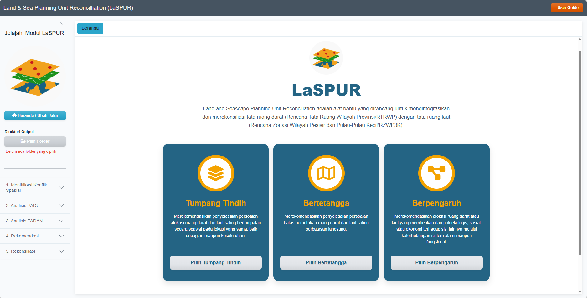

# Land & Sea Planning Unit Reconcilliation (LaSPUR)

LaSPUR provides a framework and set of tools to help stakeholders negotiate and resolve conflicts between land and sea spatial planning integration. It employs an evidence-based approach to ensure that spatial management is informed by the careful consideration of ecosystem protection, economic value, and the continuity of community living spaces.

## What does LaSPUR offer?

LaSPUR provides a tool designed to help resolve conflicts and reconcilliation in the integration of land and sea spatial planning, categorized into three steps:

- Step 1: Overlapping Areas Areas where Land Spatial Plans (RTRW) and Sea Spatial Plans (RZWP3K) occupy the same geographical space.
- Step 2: Adjacent Areas Areas where land and sea planning boundaries directly meet or border one another.
- Step 3: Interdependent Linkage Areas Areas that are not directly adjacent but are linked by ecological or functional processes, where activities in one space potentially impact the other.

## How to Use LaSPUR

LaSPUR is available as both a Quarto notebook and a Shiny application, so you can choose the workflow that fits your needs.

### 1. Run Directly from GitHub

The quickest way to try LaSPUR, no cloning required.

``` r
# Install shiny if you haven't already
if (!require("shiny")) install.packages("shiny")

# Run the application from the GitHub repository
shiny::runGitHub("LaSPUR", "icraf-indonesia")
```

### 2. Run by Cloning the Repository

Recommended if you plan to explore the code, modify it, or run the notebooks.

#### Prerequisites

Ensure you have the following installed on your system: - R (v4.0 or higher) - RStudio - Quarto CLI (usually bundled with modern RStudio versions)

#### Installation & Setup

Clone the repository and navigate into the project directory:

``` bash
git clone https://github.com/icraf-indonesia/LaSPUR.git
cd LaSPUR
```

Open `LaSPUR.Rproj` in RStudio, then install the required dependencies from the R console:

``` r
# 1. Install pacman if you don't have it
if (!require("pacman")) install.packages("pacman")

# 2. Automatically install and load all required dependencies
pacman::p_load(
  bslib, future, promises, shiny, shinyFiles, shinyjs, DT, htmltools, 
  leaflet, openxlsx, sf, tools, dplyr, terra, openxlsx2, purrr, 
  rmarkdown, data.table, exactextractr, furrr, landscapemetrics, 
  stringr, tibble, tidyr, units, here, kableExtra, readxl, utils, 
  knitr, htmlwidgets, RColorBrewer
)
```

#### Run LaSPUR from Shiny

In the R console, run:

``` r
shiny::runApp("app.R")
```

#### Run LaSPUR from a Notebook

For a step-by-step, script-based view of the reconciliation process:

1.  Open the notebook: locate and open `notebook/LaSPUR_step1.qmd` or `notebook/LaSPUR_step2.qmd` in your R editor.
2.  Configure data paths: update the data section in the first code chunk to point to your local RTRW (Land) and RZWP3K (Sea) spatial datasets. You can download the [example dataset here](https://drive.google.com/drive/folders/1T8qlp-in1LfJU-07PjNwfJUgcTvCfi_H?usp=sharing) to test the module.
3.  Execute chunks: run the code blocks sequentially to process the reconciliation.

## Documentation

For a deeper walkthrough of the app and additional background, refer to the following:

- User Manual: a full guide to navigating the LaSPUR Shiny app, module by module. [User Manual](https://laspur.landseascape.id/guide.html)
- Detailed Information: further background and technical details on the LaSPUR methodology. [Detailed Information](https://laspur.landseascape.id/)


